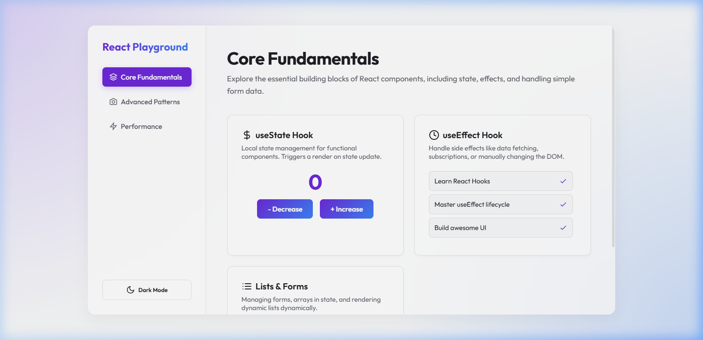

# React Playground

Welcome to your **React Playground** — a beautifully designed workspace tailored for learning, experimenting, and mastering modern React concepts.



## Overview

This project provides a clean, zero-configuration environment pre-built with typical development lifecycles and modern front-end tooling. Whether you're exploring hooks like `useState` and `useEffect`, or moving onto advanced state management and performance tuning, this playground serves as an interactive sandbox.

### Features
- 🚀 **Vite + React 19** for a lightning-fast development server.
- ✨ **Premium Aesthetics**: Engineered with custom styling including glassmorphism layouts, subtle CSS animations, and curated Google Fonts (*Outfit*).
- 🌓 **Dynamic Theming**: An interactive toggle seamless switches between Dark and Light mode reading experiences.
- 🧰 **Pre-configured Concept Demonstrations**: Immediate sandbox setups demonstrating:
  - State Persistence (`useState`)
  - Simulating Async Lifecycle Events (`useEffect`)
  - Interactive Forms and Derived React Keys

## Quick Start

1. **Install Dependencies**
   ```bash
   npm install
   ```

2. **Run Local Server**
   ```bash
   npm run dev
   ```

3. **Explore and Play**
   Open [http://localhost:5173](http://localhost:5173) in your browser. All interactive components and logic resides in `src/App.jsx`. Edit the file to immediately see HMR (Hot Module Replacement) kick in.
